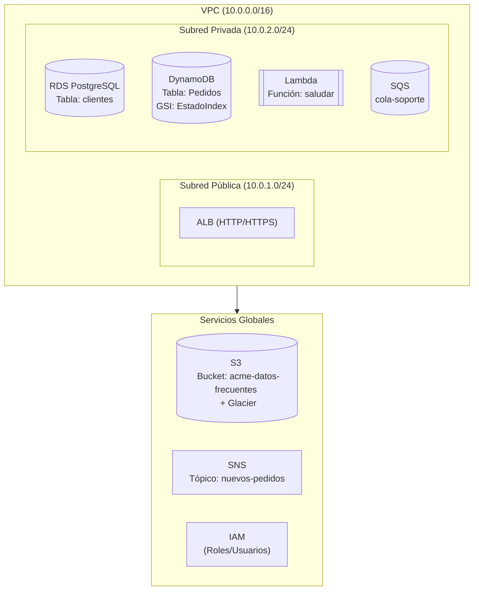

# Infraestructura Viva

## Descripción del Proyecto

**Infraestructura Viva** es una solución de arquitectura cloud diseñada para **Soluciones Digitales ACME**, que migra su entorno on-premise a una infraestructura moderna, escalable y segura utilizando servicios emulados de AWS a través de **Floci**.

El proyecto incluye la implementación de almacenamiento, bases de datos relacionales y NoSQL, cómputo serverless, redes virtuales y un sistema de mensajería y notificaciones, demostrando la capacidad de diseñar y desplegar una infraestructura cloud completa, en un entorno local controlado con Floci.

---

## Stack Tecnológico

- **Floci**: Emulador local de AWS (versión 1.5.28)
- **Docker & Docker Compose**: Contenerización y orquestación
- **AWS CLI**: Gestión de recursos
- **PostgreSQL 16.3**: Base de datos relacional
- **Python 3.12**: Funciones Lambda
- **GitHub Codespaces**: Entorno de desarrollo remoto

---

## Arquitectura de la Solución




---

## Servicios Implementados

| Servicio | Recurso | Estado |
|----------|---------|--------|
| **S3** | Bucket `acme-datos-frecuentes` + política Glacier | ✅ |
| **RDS** | Instancia `mi-postgres` (PostgreSQL 16.3) | ✅ |
| **DynamoDB** | Tabla `Pedidos` + GSI `EstadoIndex` | ✅ |
| **Lambda** | Función `saludar` (Python 3.12) | ✅ |
| **VPC** | `vpc-f69537a2` (10.0.0.0/16) con subredes pública/privada | ✅ |
| **SNS** | Tópico `nuevos-pedidos` | ✅ |
| **SQS** | Cola `cola-soporte` + suscripción a SNS | ✅ |

---

## Cómo Replicar

### 1. Clonar el repositorio
```bash
git clone https://github.com/judirodriguez/infraestructura-viva.git
cd infraestructura-viva
```

### 2. Levantar Floci
```bash
docker compose up -d
```

### 3. Configurar credenciales
```bash
source .env
```

### 4. Verificar estado
```bash
aws s3 ls
```
---

## Comandos de Verificación
```bash
# Listar buckets
aws s3 ls

# Ver RDS
aws rds describe-db-instances

# Ver DynamoDB
aws dynamodb list-tables

# Ver Lambda
aws lambda list-functions

# Ver VPC
aws ec2 describe-vpcs

# Ver SNS
aws sns list-topics

# Ver SQS
aws sqs list-queues
```
---

## Notas Técnicas

### Permisos en Floci
Para evitar errores de acceso, el contenedor se ejecuta como root:

```yaml
user: "0:0"
```

### Invocación de Lambda

Usar --cli-binary-format raw-in-base64-out para evitar errores de codificación:

```bash
aws lambda invoke --function-name saludar --payload '{"name": "test"}' --cli-binary-format raw-in-base64-out response.json
```

###Credenciales en AWS CLI

Las credenciales test/test son válidas para Floci y están configuradas en ~/.aws/credentials.

## Referencias

- [Floci Documentation](https://floci.io/floci/)
- [AWS CLI Documentation](https://aws.amazon.com/cli/)